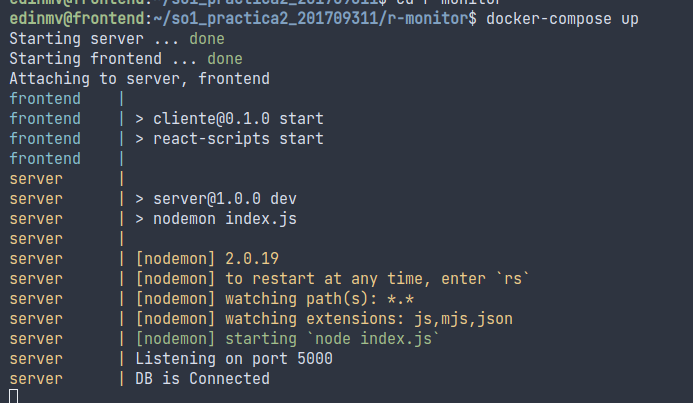
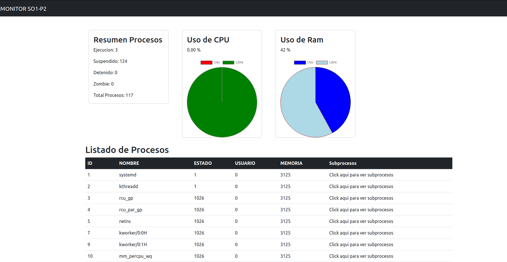

# Pasos para levantar frontend correctamente

# LOCAL(sin docker)

1. ingresar a la carpeta server y ejecutar en consola:
   npm run dev (este es el server que se conecta con mysql)

2. ingresar a la carpeta client y ejecutar en consola
   npm start (esto levantara el html de react para poder visualizar el front)

# CON DOCKER 
1. quedarse en carpeta raiz de frontend (r-monitor) y ejecutar los siguientes comandos (debe estar instalado docker previamente)
   
   1. docker pull edinmv/server_p2_201709311   (para descargar imagen)
   2. docker pull edinmv/frontend_p2_201709311  (para descargar imagen)

   3. buscar el archivo docker compose y ejecutar
   4. docker-compose up

   
   
